# Boot From SD Card

Intel Galileo Gen 2 can boot from a micro SD card. This section explains how to write a Galileo linux image to SD card and boot from SD card.

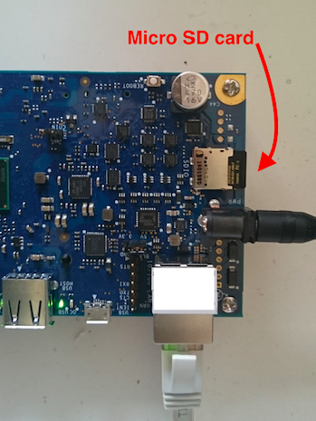

## Getting Image
You can get the Galileo's linux image by following [Building Galileo Image on Debian](building_galileo_image_from_debian.md) or download it [here](http://sourceforge.net/projects/ndn-in-one/files/image.tar.gz), built by the authors.

## Preparing SD Card
If you don't have a micro SD card reader, get a micro to SD card converter.
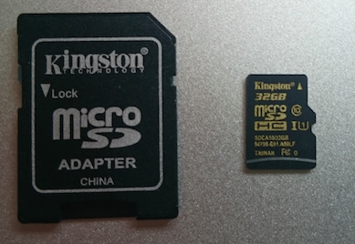

We need to format the SD card and make sure it has correct partition before we copy kernel images onto it.
* SD card should have partition type `Master Boot Record` (MBR)
* SD card should have one partition of type `FAT32`

After SD card is prepared, simply copy all five files/folder in the image to SD card
1. boot/
2. bzImage
3. core-image-minimal-initramfs-clanton.cpio.gz
4. grub.efi
5. image-full-galileo-clanton.ext3

If, for some reason, networking is not availale, you can [use a FTDI232 TTL 3.3V cable](https://communities.intel.com/message/247258) with an appropriate terminal software, such as [PuTTY](http://www.putty.org/) in Windows, to connect to the serial console of Galileo. When Galileo boots up, you can see the options

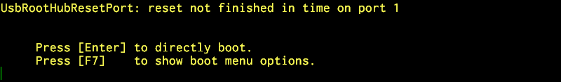

select items on the grub menu

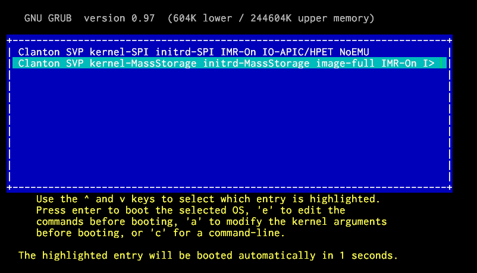

and go through the whole booting process to see if there is any issue.

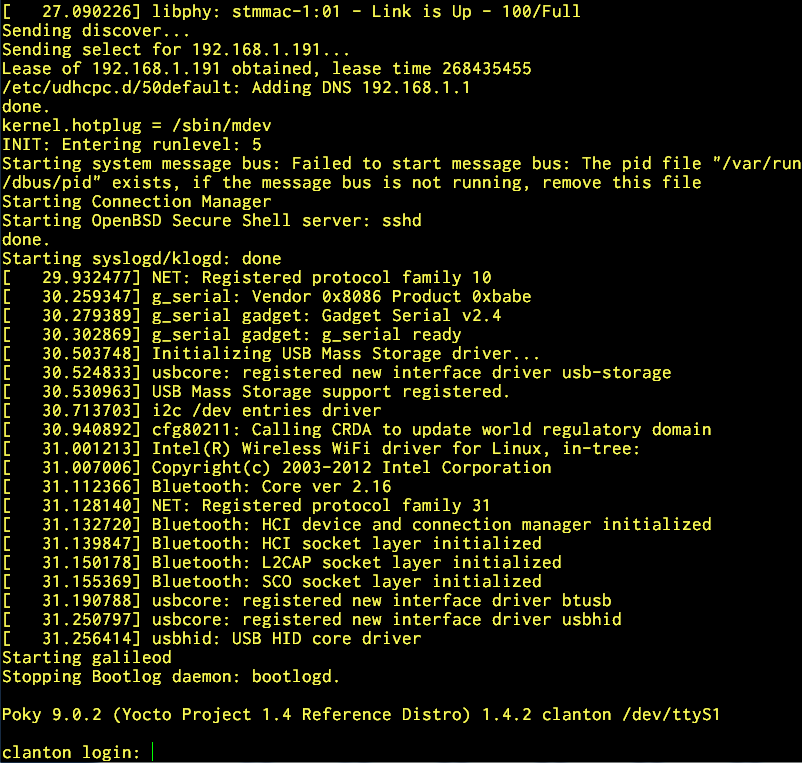

## Example: Debian 7.8
To demontrate how it is done on Debian 7.8, let's use a GUI Disk utility: `Applications/Accessories/Dist Utility`

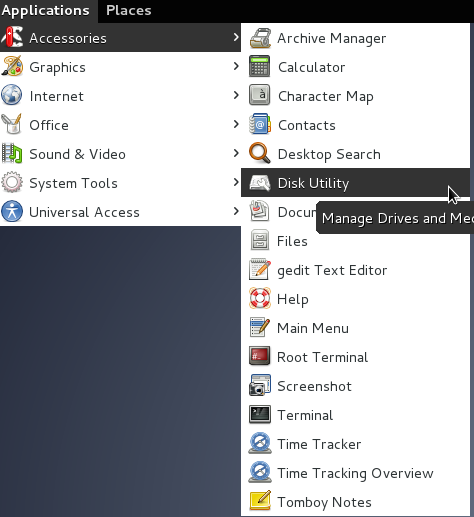

1. Select Unmount Volume, then Format Drive, and format the SD card into `Master Boot Record`. If you get an error during this process, try first using the Format Volume option before proceeding with the remainder of the steps.
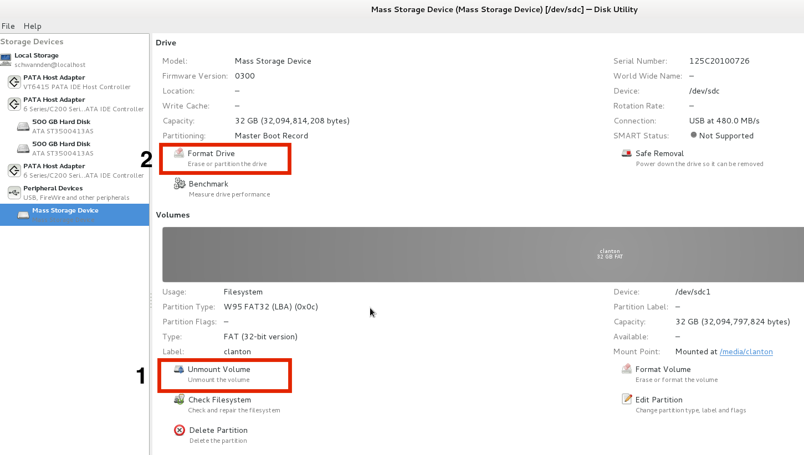
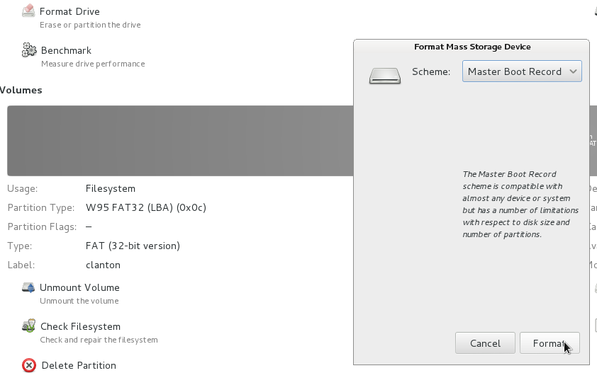

2. Select Add Partition, then add a `FAT` partition
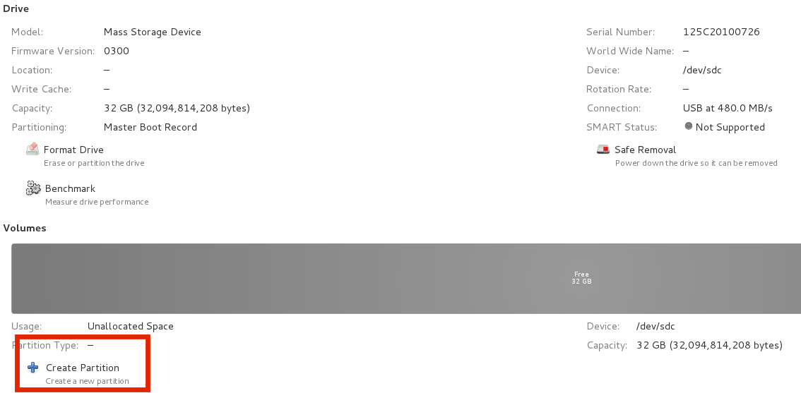


3. Now you can copy everything to SD card
```
cp -rL boot/ bzImage core-image-minimal-initramfs-clanton.cpio.gz grub.efi image-full-galileo-clanton.ext3 /media/clantonCF/
```

# Example: Mac Yosemite
1. Insert your SD card
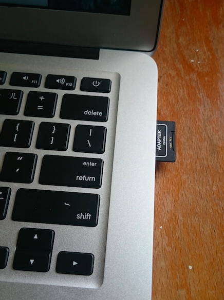

2. Open Disk Utility
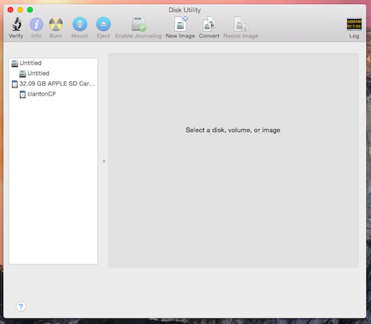

3. Format the SD card
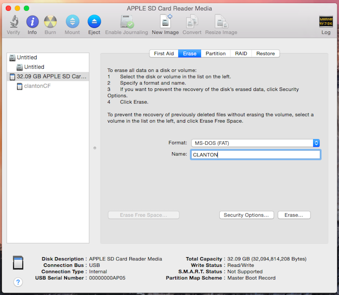

4. Copy files to SD card

