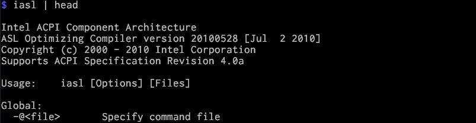
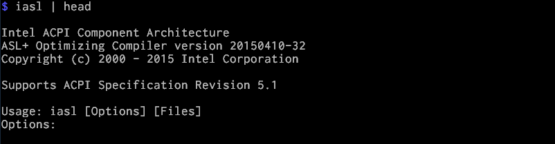

# Building Galileo Image on Debian

Firstly, create a directory to do all the work
```
mkdir ~/ndn
cd ~/ndn
```

#### Pre-requisites
Install all the pre-requisite
```
sudo apt-get install vim gcc g++ git make build-essential subversion libcurl4-openssl-dev uuid-dev autoconf texinfo libssl-dev libtool diffstat gawk chrpath openjdk-7-jdk connect-proxy autopoint gettext p7zip-full gcc-multilib vim-common wget git-core iasl
```
Try ` iasl | head ` to see if ACPI 5.0 or up is supported. If you see something like



You will need to manually install it yourself.
#### Manual Installation for iasl
Pre-requisite of iasl:
```
sudo apt-get install libbison-dev flex
```
Getting and compiling iasl:
```
mkdir iasl
cd iasl
git clone https://github.com/acpica/acpica.git
cd acpica
make
```
Starting to use the newly built iasl:
```
sudo make install
```
Again, try ` iasl | head ` to see if ACPI 5.0 or up is supported. It should be now.



A possible error may happen during `iasl` compilation, see remark at the end.

#### Getting Recipes
This is the specific meta package I use for my build: `https://github.com/schwannden/Galileo-Runtime`, which is forked from ` https://github.com/01org/Galileo-Runtime on 2015/2/1`. I forked it because I intend to maintain it as a customized meta package for NDN development. So it is suggested you clone from my repository.

```
cd ~/ndn
git clone https://github.com/schwannden/Galileo-Runtime
cd Galileo-Runtime
```

Because we are building an SD card image, we need only the following two folders:

This is the major folder that contains all the recipes for building galileo
```
tar -xzf meta-clanton_v1.0.1.tar.gz
```
This contains all the patches
```
tar -xzf patches_v1.0.4.tar.gz
```
Firstly, we apply the patches. The script will in turn calls the setup.sh in `meta-clanton_v1.0.1` to clone addition meta folders (meta-oe and meta-intel) and apply the patches
```
./patches_v1.0.4/patch.meta-clanton.sh
```

Now, if you do `ls meta-clanton_v1.0.1`, you can see all the meta directory.


Because NDN project requires Boost library, which is not provided by default, we need to get it at [Open Embedded Metadata Index](http://layers.openembedded.org/layerindex/branch/master/layer/openembedded-core/). Go to [Open Embedded Metadata Index](http://layers.openembedded.org/layerindex/branch/master/layer/openembedded-core/), one can see boost is provided. Go to [boost index](http://layers.openembedded.org/layerindex/recipe/5268/), at the time of writing, they provide boost 1.57, which is not suitable for NDN development. We can find older version of boost_1-55 [here](http://cgit.openembedded.org/cgit.cgi/openembedded-core/commit/?id=e0bc74e14f7ad67ff85959ce7c0a111d05ac7f2f), in download tag, download and extract [this file](http://cgit.openembedded.org/openembedded-core/snapshot/openembedded-core-e0bc74e14f7ad67ff85959ce7c0a111d05ac7f2f.tar.gz).

```
wget http://cgit.openembedded.org/openembedded-core/snapshot/openembedded-core-e0bc74e14f7ad67ff85959ce7c0a111d05ac7f2f.tar.gz
tar -xzvf openembedded-core-e0bc74e14f7ad67ff85959ce7c0a111d05ac7f2f.tar.gz
```
All we need is boost's recipe so copy the `boost` folder into one of our working directory's meta-* folder. Since this is provided by [Open Embedded](http://layers.openembedded.org/layerindex/branch/master/layer/openembedded-core/), let's copy it into `meta-oe` folder.
```
cd openembedded-core-e0bc74e14f7ad67ff85959ce7c0a111d05ac7f2f
cd meta/recipes-support
cp -r boost ~/ndn/Galileo-Runtime/meta-clanton_v1.0.1/meta-oe/meta-oe/recipes-support
```
Now we have all we need for building Galileo image!

#### Applying changes
```
cd ~/ndn/meta-clanton_v1.0.1
```
First we need to edit image recipe to make sure all relevent packges are in Galileo.  Edit `meta-clanton-distro/recipes-core/images/image-full.bb`
1. increase the image filesystem ten times to around 3 G:
    `IMAGE_ROOTFS_SIZE = "3072000"`
2. Add features:
    `IMAGE_FEATURES += "package-management dev-pkgs"`
    The added option `dev-pkgs` means install the development packages (headers and extra library links) for all packages installed in a given image.
3. Add packages
    ```IMAGE_INSTALL += "autoconf automake binutils binutils-symlinks cpp cpp-symlinks gcc gcc-symlinks g++ g++-symlinks gettext make libstdc++ libstdc++-dev file coreutils boost"```

Then edit `meta-oe/meta-oe/recipes-support/boost/boost.inc` to add `chrono` and `random` libraries. These two libraries are not installed by default, but are needed for NDN development (one can find out what boost libraries are required in `.waf-tools/boost.py`).

```
  7 BOOST_LIBS = "\
  8         date_time \
  9         chrono \
 10         random \
 11         filesystem \
 12         graph \
 13         iostreams \
 14         program_options \
 15         regex \
 16         serialization \
 17         signals \
 18         system \
 19         test \
 20         thread \
 21         "
```

#### Building Image
```
cd ~/ndn/Galileo-Runtime/meta-clanton_v1.0.1
```
First set up environment. oe-init-build-env will set up environment variable for Yocto build system, and automatically change directory tot he vuild directory. The default is `build/`, but here we specify `yocto_build`.

```
source poky/oe-init-build-env yocto_build
```

Now you should be in `yocto_build` directory, simply build the image by:
```
bitbake image-full-galileo
```
It should take more than a hour. On my Intel i5 it takes 2 hours. Do not panic if you see errors, sometimes your network or repository is not stable, it timed out when fetching some packages, just re-build again or in case the repository is really dead, add the live repository (this is more complicated, see [Debug Yocto](debug_yocto.md) section at the end of the chapter).

If the build succeed, the image is compiled in `yocto_build/tmp/deploy/images`.

#### Porting the image to SD card
Galileo uses micro SD card, so need a machine that reads micro SD card. I simply use a micro SD to SD card adapter. In Debian, we can simply use the `Disk Utility` in `Applications/Accessories/Dist Utility` to format SD card. First format the SD card into `master boot record`, then add a `FAT` partition, and copy the following 5 files from `yocto_build/tmp/deploy/images` onto the SD card.
1. boot/
2. grub.efi
3. bzImage
4. core-image-minimal-initramfs-clanton.cpio.gz
5. image-full-galileo-clanton.ext3

Notice some renaming is required, because Yocto insert the date-time as part of the name on each build, so you might see, for example, `image-full-galileo-clanton-20150226141940.rootfs.ext3`.

Now insert the micro SD card into Galileo, and you are all set booting your Galileo image. By default, the image has ssh server daemon starts on boot time, with standard port (22) and user `root` with no password

* See [Boot From SD Card](boot_from_sd_card.md) for more detail.
* See [Debug Galileo](debug_galileo.md) for some hacks on debugging and connecting to Galileo.

#### Remark
* `iasl` bug

At the time of writing (before `acpica commit 8e2118`), the Makefile for `iasl` treats warning messages as fatal, causing the compilation to fail due to line 660 of `source/components/events/evgpe.c` with usage of an uninitialized variable `Status`. Just initialize `Status` to 0 at line 635 and `make` it.


