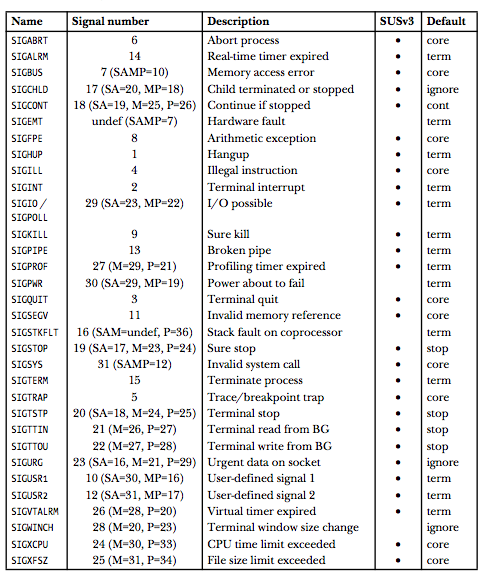
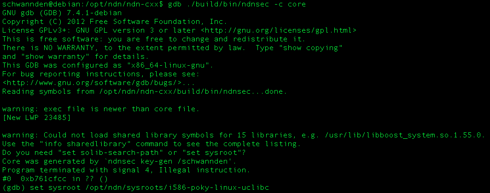
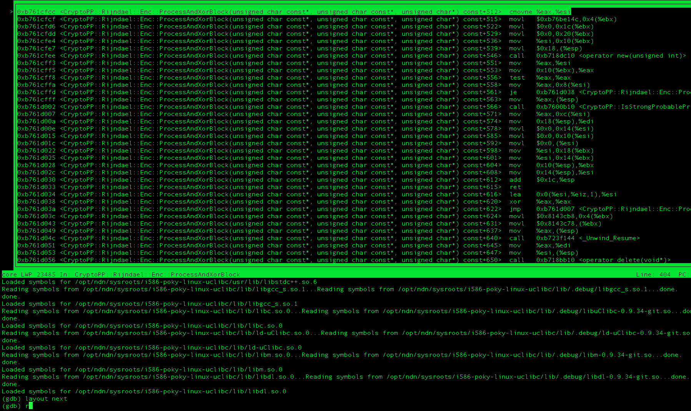

# Debug Galileo

Mostly it is related to connection problem.

### DHCP Server Mis-configuration
Just connect a normal device (your cell phone, laptop) to your DHCP server. If it works, your DHCP server is fine.

### Network Problem
If you think maybe it is the network problem, the routing process is wrong, try assign Galileo a static IP to make things simpler. Mount the image's file system on your host by `mount -t ext3 -o loop image-full-galileo-clanton.ext3 /tmp/sdcard` and edit `/etc/network/interfaces` to assign `eth0` a static IP and gateway. They manually set up path from your host by adding static arp entry `arp -s static-ip-of-galileo mac-of-galileo`. If all these does not work, your image could be corrupted.

### Corrupted Image
1. Are you using partition type `master boot record` with a `FAT32` partition?
2. Did you rename the files corrected? Maybe you delete one more character?
3. Did you copy the images from the same build? For example, every build updates `image-full-galileo-clanton.ext3`, and `core-image-minimal-initramfs-clanton.cpio.gz`. Combining two files from different build might not work.


### Illegal instruction (`SIGILL`)
Usually this is due to the wrong flag during cross compilation. `SIGILL` is sent to a process if it tries to execute an illegal machine-language instructions. Two possible cases are

1. Incorrectly formed machine-language instruction by compiler. In this case, you are probably helpless as you need to fix your compiler.... Usually though, gdb is fairly stable, you get `SIGILL` because of the second case.
2. Your CPU encounter a unknown instruction (note from CPU's point of view, an illed-formed instruction is the same as an unknown instruction).

The unknown instruction could be generated by your compiler when you issued the wrong flag during cross compilation. But if you cross compiled a bunch of stuff, and the dependencies are a huge mess, how do you quickly know which program or libraries contains the illegal instruction.?

The answer is core dump. A core dump is a file containing a memory image of the process at the time it terminated. (The term core derives from an old memory technology.) This memory image can be loaded into a debugger in order to examine the state of a program’s code and data at the moment when the signal arrived.

The following table from [tlpi](http://man7.org/tlpi/) illustrates the default behabior of a process when it receive a signal. `core` means generating a core dump file. Here we see `SIGILL` generates a core dump.



However, Galileo's Yocto image is a small system with limited storage, unlike your PC, it does not generate core dump by default (otherwise the filesystem is quickly overloaded with the core file). Enable the core dump by

`ulimit -c unlimited`

`ulimit` is a shell utility that set shell and process resource limite. `-c` flag means to set the limit on the size of a core dump file (default is 0 for the Yocto image, so no core dump is generated). `unlimited` means... well... unlimited.

In this linux image, core dump is generated to the executing directory of the process that generate core dump. The name of the core dump is `core` (All this is adjustable, see [core pattern](https://sigquit.wordpress.com/2009/03/13/the-core-pattern/)). After obtaining a core dump, we can use gdb to analyze it.

Assuming gdb is not available in your Galileo, copy the core file to your SDK tool chain, open it with the executable that generate it
`gdb ./build/bin/ndnsec -c core -tui`
you will see something like

Here I set `sysroot` to `$PKG_CONFIG_SYSROOT_DIR` so that it links to correct libraries.

next give
```
layout next
r
```

`layout next` will show the following machine-language instruction. 

`r` will run the program until `SIGILL`, you can see exactly which instruction in which file gives you the error. And now you can further see if the instruction is in the ISA of Galileo's Intel Quark SoC X1000 Core (see [Developer’s Manual](http://cse.unl.edu/~goddard/Courses/CSCE351/IntelArchitecture/InstructionSetSummary.pdf)).

If it is not, that means when you compile that file, instructions outside i586 architecture is used.